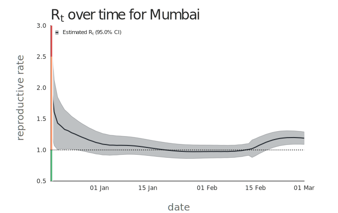
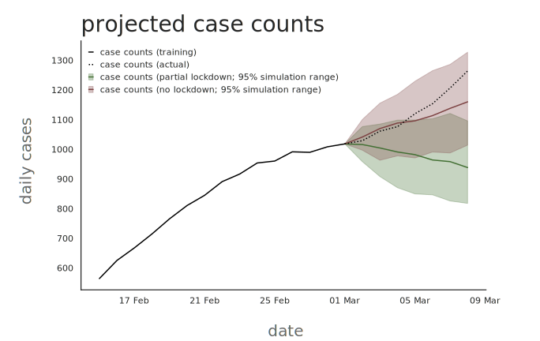

<h1 align="center">epimargin</h1>

  

a public health policy analysis toolkit consisting of: 
1. Bayesian simulated annealing estimator for the reproductive rate (<i>Rt</i>)
2. a stochastic compartmental model class supporting multiple compartment schemes (SIR, SEIR, SIRV, subpopulations, etc.)
3. policy impact evaluation that calculates longevity benefits and economic activity disruption/resumption under scenarios including: 
    - targeted lockdowns
    - urban-rural migration and reverse-migration flows
    - multiple vaccine allocation prioritizations 

# organization
- `epimargin` - core package with model and estimator classes 
- `studies` - specific applications to geographies and policy evaluation exercises

# installation  
The `epimargin` package is available on PyPI and can be installed via `pip`: 
    
    pip install epimargin

# support and issues 
Please [file an issue on Github](https://github.com/COVID-IWG/epimargin/issues/new/choose) if you run into any problems with the software.

# contributions and development 
Contributions are always welcome! Please fork the repository and open a new pull request for any new features.

For development, clone the repository, install the development dependencies, and install the package in editable mode: 

    git clone https://github.com/COVID-IWG/covid-metrics-infra 
    cd covid-metrics-infra 

    pip install -r requirements.txt
    pip install -e . 

We recommend using a virtual environment for development.

# tutorial 
In this tutorial, we will download a timeseries of daily confirmed COVID-19 cases in Mumbai from COVID19India.org, estimate the reproductive rate for the city over time, plug these estimates into a compartmental model, and compare two policy scenarios by running the compartmental model forward. The entire tutorial can be found in the `studies/tutorial` directory.

## 1. setup
After installing the package, import some commonly-used tools and set up convenience functions/variables:

    from itertools import cycle

    import epimargin.plots as plt
    import numpy as np
    import pandas as pd
    from epimargin.utils import setup

    (data, figs) = setup() # creates convenient directories
    plt.set_theme("minimal")

## 2. download and clean data 
Next, download data on daily COVID19 cases in the city of Mumbai from COVID19India.org. The data are noisy, so we apply a notch filter to remove weekly reporting artifacts and smooth using a convolution:
    
    from epimargin.etl import download_data
    from epimargin.smoothing import notched_smoothing

    download_data(data, "districts.csv", "https://api.covid19india.org/csv/latest/") 

    # load raw data
    daily_reports = pd.read_csv(data / "districts.csv", parse_dates = ["Date"])\
        .rename(str.lower, axis = 1)\
        .set_index(["state", "district", "date"])\
        .sort_index()\
        .loc["Maharashtra", "Mumbai"]
    daily_cases = daily_reports["confirmed"]\
        .diff()\
        .clip(lower = 0)\
        .dropna()\

    # smooth/notch-filter timeseries
    smoother = notched_smoothing(window = 5)
    smoothed_cases = pd.Series(
        data  = smoother(daily_cases),
        index = daily_cases.index
    )

    # plot raw and cleaned data 
    beg = "December 15, 2020"
    end = "March 1, 2021"
    training_cases = smoothed_cases[beg:end]

    plt.scatter(daily_cases[beg:end].index, daily_cases[beg:end].values, color = "black", s = 5, alpha = 0.5, label = "raw case count data")
    plt.plot(training_cases.index, training_cases.values, color = "black", linewidth = 2, label = "notch-filtered, smoothed case count data")
    plt.PlotDevice()\
        .l_title("case timeseries for Mumbai")\
        .axis_labels(x = "date", y = "daily cases")\
        .legend()\
        .adjust(bottom = 0.15, left = 0.15)\
        .format_xaxis()\
        .size(9.5, 6)\
        .save(figs / "fig_1.svg")\
        .show()

NOTE: a copy of the reference timeseries for all districts available through the API is checked into the `studies/tutorial/data` folder in case you run into download issues or if the upstream API changes.

## 3. estimate the reproductive rate, <i>Rt</i>
From these data, we can estimate the reproductive rate, or the number of secondary infections caused by a single active infection. A pandemic is under control if the reproductive rate stays below 1. A number of estimation procedures are provided; we show the Bettencourt/Soman estimator as an example:

    from epimargin.estimators import analytical_MPVS

    (dates, Rt, Rt_CI_upper, Rt_CI_lower, *_) = analytical_MPVS(training_cases, smoother, infectious_period = 10, totals = False)
    plt.Rt(dates[1:], Rt[1:], Rt_CI_upper[1:], Rt_CI_lower[1:], 0.95, legend_loc = "upper left")\
        .l_title("$R_t$ over time for Mumbai")\
        .axis_labels(x = "date", y = "reproductive rate")\
        .adjust(bottom = 0.15, left = 0.15)\
        .size(9.5, 6)\
        .save(figs / "fig_2.svg")\
        .show()

## 4. set up a model and run it forward to compare policy scenarios

Finally, we can use the case count data and estimated reproductive rate to project forward cases. We also show how the input data can be modified to test hypotheses about specific policies. For example, you might expect a lockdown policy to reduce the reproductive rate by 25% given historical mobility data or lockdown stringency indices. Assuming a successful reduction in <i>Rt</i>, what does the trajectory of daily cases look like?

    from epimargin.models import SIR

    num_sims = 100
    N0 = 12.48e6
    R0, D0 = daily_reports.loc[end][["recovered", "deceased"]]
    I0  = smoothed_cases[:end].sum()
    dT0 = smoothed_cases[end]
    S0  = N0 - I0 - R0 - D0
    Rt0 = Rt[-1] * N0 / S0
    no_lockdown = SIR(
        name = "no lockdown", 
        population = N0, 
        dT0 = np.ones(num_sims) * dT0, Rt0 = np.ones(num_sims) * Rt0, I0 = np.ones(num_sims) * I0, R0 = np.ones(num_sims) * R0, D0 = np.ones(num_sims) * D0, S0 = np.ones(num_sims) * S0, infectious_period = 10
    )
    lockdown = SIR(
        name = "partial lockdown", 
        population = N0, 
        dT0 = np.ones(num_sims) * dT0, Rt0 = np.ones(num_sims) * 0.75 * Rt0, I0 = np.ones(num_sims) * I0, R0 = np.ones(num_sims) * R0, D0 = np.ones(num_sims) * D0, S0 = np.ones(num_sims) * S0, infectious_period = 10
    )

    # run models forward 
    simulation_range = 7
    for _ in range(simulation_range):
        lockdown   .parallel_forward_epi_step(num_sims = num_sims)
        no_lockdown.parallel_forward_epi_step(num_sims = num_sims)

    # compare policies 
    test_cases = smoothed_cases["February 15, 2021":pd.Timestamp(end) + pd.Timedelta(days = simulation_range)]
    date_range = pd.date_range(start = end, periods = simulation_range + 1, freq = "D")
    legend_entries = [plt.predictions(date_range, model, color) for (model, color) in zip([lockdown, no_lockdown], cycle(plt.SIM_PALETTE))]
    train_marker, = plt.plot(test_cases[:end].index, test_cases[:end].values, color = "black")
    test_marker,  = plt.plot(test_cases[end:].index, test_cases[end:].values, color = "black", linestyle = "dotted")
    markers, _ = zip(*legend_entries)
    plt.PlotDevice()\
        .l_title("projected case counts")\
        .axis_labels(x = "date", y = "daily cases")\
        .legend(
            [train_marker, test_marker] + list(markers),
            ["case counts (training)", "case counts (actual)", "case counts (partial lockdown; 95% simulation range)", "case counts (no lockdown; 95% simulation range)"],
            loc = "upper left"
        )\
        .adjust(bottom = 0.15, left = 0.15)\
        .size(9.5, 6)\
        .format_xaxis()\
        .save(figs / "fig_3.svg")\
        .show()

The median projections from the no-lockdown model (crimson) mirror the observed timeseries (dotted black) fairly well, and the model predicts that even an imperfect lockdown would have changed the trajectory of the pandemic at the time period we looked at. As the model is stochastic, we show a range of outcomes (shaded) and note the model accuracy decreases as the projection period goes on. In real-time settings, we encourage daily updating of projections to handle new data.
