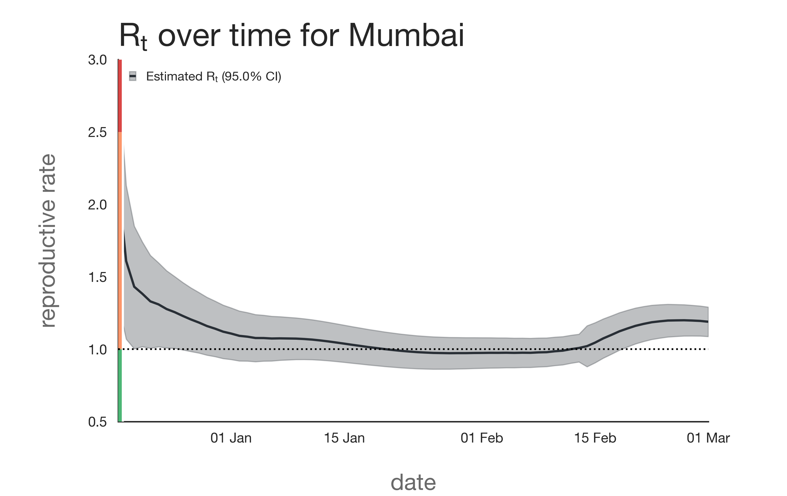
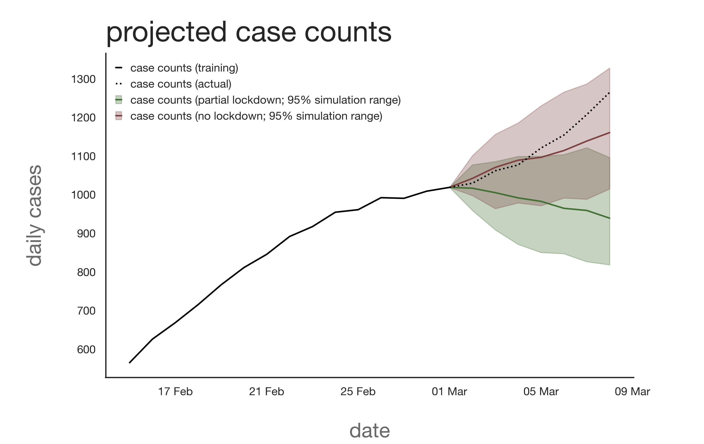

# Summary
As pandemics (including the COVID-19 crisis) pose threats to societies, public health officials, epidemiologists, and policymakers need improved tools to assess the impact of disease, as well as a framework for understanding the effects and tradeoffs of health policy decisions. The `epimargin` package provides functionality to answer these questions in a way that incorporates and quantifies irreducible uncertainty in both the input data and complex dynamics of disease propagation.  

The `epimargin` software package primarily consists of: 

1. a set of Bayesian estimation procedures for epidemiological metrics such as the reproductive rate ($R_t$), which is the average number of secondary infections caused by an active infection

2. a flexible, stochastic epidemiological model informed by estimated metrics and reflecting real-world epidemic and geographic structure, and 

3. a set of tools to evaluate different public health policy choices simulated by the model.

The software is implemented in the Python 3 programming language and is built using commonly-used elements of the Python data science ecosystem, including NumPy [@harris2020array], Scipy [@virtanen2020scipy], and Pandas [@mckinney2011pandas].

# Statement of need

The `epimargin` software package is designed for the data-driven analysis of policy choices related to the spread of disease. It consists primarily of a set of estimators for key epidemiological metrics, a stochastic model for predicting near-future disease dynamics, and evaluation tools for various policy scenarios. 

Included with the package are connectors and download utilities for common sources of disease data for the COVID-19 pandemic (the pressing concern at the time of writing), as well as a set of tools to prepare and clean data in a format amenable to analysis. It is widely understood that preprocessing epidemiological data is necessary to make inferences about disease progression [@gostic2020practical]. To that end, `epimargin` provides commonly-used preprocessing routines to encourage explicit documentation of data preparation, but is agnostic to which procedures are used due to the fact that all metadata required for certain preparations may not be uniformly available across geographies. 

This same modularity extends to both the estimation procedures and epidemiological models provided by `epimargin`. While the package includes a novel Bayesian estimator for key metrics, classical approaches based on rolling linear regressions and Markov chain Monte Carlo sampling are also included. The core model class in `epimargin` in which these estimates are used is known as a <i>compartmental</i> model: a modeled population is split into a number of mutually-exclusive compartments (uninfected, infected, recovered, vaccinated, etc) and flows between these compartments are estimated from empirical data. The exact choice of compartments and interactions is left to the modeler, but the package includes several commonly-used models, as well as variations customized for specific policy questions (such as large-scale migration during pandemics, or the effects of various vaccine distribution policies).

Attempts to use a compartmental model to drive policy decisions often treat the systems under study as deterministic and vary parameters such as the reproductive rate across a range deemed appropriate by the study authors [@bubar2021model]. This methodology complicates incorporation of recent disease data and the development of theories for why the reproductive rate changes due to socioeconomic factors external to the model. The incorporation of stochasticity into the models from the outset allows for the quantification of uncertainty and the illustration of a range of outcomes for a given public health policy under consideration.

The `epimargin` package has been used to drive a number of research projects and inform policy decisions in a number of countries:

1. lockdown, quarantine planning, migrant return policies, and vaccine distribution in India and Indonesia (at the behest of national governments, regional authorities, and various NGOs)

2. an illustration of a novel Bayesian estimator for the reproductive rate as well as general architectural principles for real-time epidemiological systems [@bettencourt2020systems]

3. a trigger-based algorithmic policy for determining when administrative units of a country should exit or return to a pandemic lockdown based on projected reproductive rates and case counts [@malani2020adaptive]

4. a World Bank study of vaccination policies in South Asia [@southasiavaccinates]

5. a general framework for quantifying the health and economic benefits to guide vaccine prioritization and distribution [@vaccineallocation]

# Figures
Sample output for common workflows are illustrated in the following figures:

## downloaded and cleaned time series
{ width=80% }

## estimated reproductive rate
{ width=80% }

## forward projection/policy comparison
{ width=80% }

# Acknowledgements

We acknowledge code review and comments from Gyanendra Badgaiyan (IDFC Institute), ongoing conversations with Anup Malani (University of Chicago) and Nico Marchio (Mansueto Institute) and helpful discussions with Katelyn Gostic (University of Chicago) and Sarah Cobey (University of Chicago).

# References 